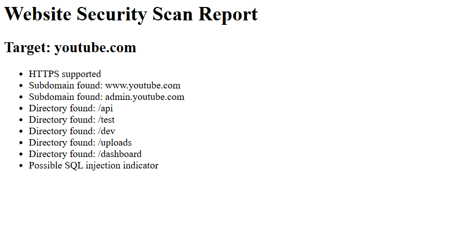

# 🔐 Website Security Scanner


A Python-based cybersecurity tool that performs automated security analysis on websites.

## ⭐ Project Highlights

• Automated website security analysis  
• Detects important security headers  
• Discovers common subdomains and directories  
• Performs basic vulnerability probing  
• Generates structured HTML and text reports
---

# 🚀 Features

* HTTPS support detection
* Security header analysis
* Common port scanning
* Subdomain discovery
* Directory enumeration
* Multi-threaded scanning
* Basic vulnerability checks (SQL injection indicators & XSS reflection)
* Automatic text report generation
* HTML security report generation

---

# 🛠 Technologies Used

* Python
* Requests library
* Socket networking
* Multithreading
* Colorama (colored terminal output)

---

# 📦 Installation

Clone the repository:

```
git clone https://github.com/YOUR_USERNAME/website-security-scanner.git
```

Install dependencies:

```
pip install requests
pip install colorama
```

---
## ⚙️ Installation

Clone the repository:

```
git clone https://github.com/henil-modi/website-security-scanner.git
```

Navigate to the project directory:

```
cd website-security-scanner
```

Run the scanner:

```
python scanner.py --target example.com
```

# ▶ Usage

Run the scanner with:

```
python scanner.py --target example.com
```

## 🎥 Demo

Example command:

python scanner.py --target youtube.com

## Example Scan Output

Target: youtube.com  
IP Address: 142.251.42.238  

HTTPS supported  

Security headers detected:
- X-Frame-Options
- Content-Security-Policy
- Strict-Transport-Security

Subdomains discovered:
- www.youtube.com
- admin.youtube.com

Directories discovered:
- /api
- /test
- /dev

📊 Example Security Report

Below is an example of the HTML report generated by the scanner.



---

# 📄 Generated Reports


The scanner automatically generates:

```
scan_report.txt
scan_report.html
```

Open the HTML file in a browser to view the results.

---

# ⚠ Disclaimer

This project was created for **educational purposes** to demonstrate cybersecurity concepts such as automated scanning and vulnerability detection.

Do not use it to scan

👨‍💻 Author

Henil Modi
A student exploring cybersecurity and secure software development.
